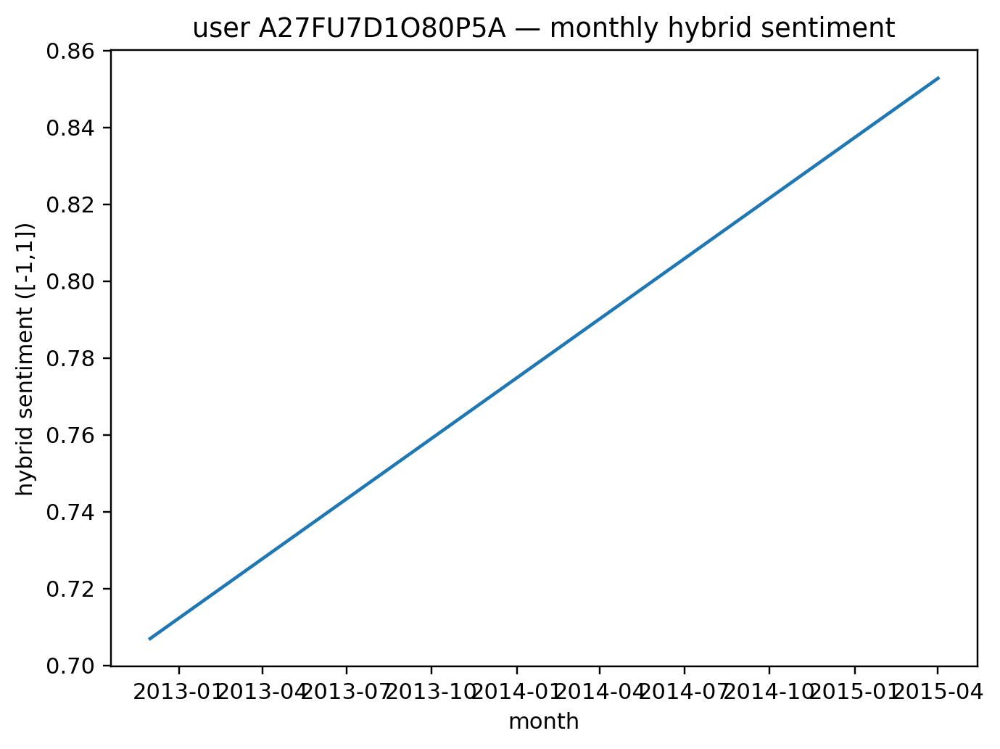
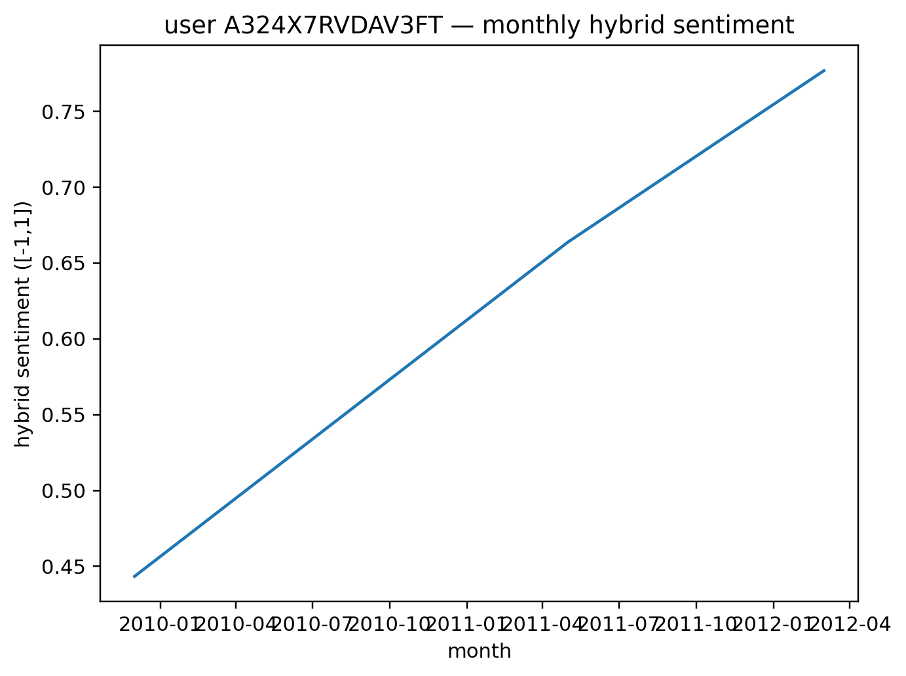

# ReviewMirror — Tracking Opinion Change in Amazon Reviews

> **Do people's opinions change over time? We found out—and it's interesting!**

[](https://www.python.org/downloads/)
[]()

---

## 🎯 What We Did

Most sentiment analysis treats each review independently. We asked: **What if we track the SAME user over time?** Do they get happier? More critical? Unstable?

We analyzed **17,706 Amazon Electronics reviews** from **2,657 users** (1996–2018) and discovered **4 distinct types of reviewers**.

---

## 📊 The 4 Types of Reviewers We Found

| Type | % of Users | What They Do | Example |
|------|------------|--------------|---------|
| **😊 Stable Majority** | 67% | Consistent opinions, barely change | Always happy with purchases |
| **🎢 Volatile Critics** | 11% | Wild mood swings, unpredictable | Love one product, hate the next |
| **↔️ Flip-Floppers** | 9% | Constantly switch positive ↔ negative | Can't make up their mind |
| **📈 Improvers** | 1% | Get MUCH happier over time | Started grumpy, ended satisfied |

**Most Interesting Finding:** The "Improvers" (only 39 people!) showed **750× stronger** positive drift than average—genuine satisfaction improvement over years!

---

## 🔢 Our Numbers (The Results)

### Main Achievement
- **10.27% better predictions** than the naive approach
- Discovered user groups are **statistically real** (p < 0.0000000001)
- Our method: predict using user's group vs. treating everyone the same

### Comparing Two Approaches

We tested **two ways** to group similar users:

| Method | What It Does | Prediction Accuracy | Cluster Balance | Cluster Tightness |
|--------|--------------|---------------------|-----------------|-------------------|
| **K-means** | Groups by behavior patterns | ✅ **Better** (MAE: 0.0196) | ❌ Unbalanced (67% in 1 group) | ⚠️ Looser |
| **Graph Neural Network** | Groups by who reviews similar products | ❌ Worse (MAE: 0.0220) | ✅ Balanced (64% max) | ✅ **58% tighter!** |

**Takeaway:** Both methods find *different* user groups—K-means is better for predicting drift, GNN is better for recommendation systems.

---

## 🧪 How We Did It (Simple Version)
```
Step 1: Get Reviews
   ↓
Step 2: Calculate Sentiment (text + star rating)
   ↓
Step 3: Group by Month (per user)
   ↓
Step 4: Measure Change Over Time
   - Slope: Are they trending up or down?
   - Volatility: How bumpy is the ride?
   - Flips: Do they change their mind often?
   ↓
Step 5: Find Similar Users (clustering)
   ↓
Result: 4 Behavioral Types!
```

### The Formula We Used
```
Sentiment = 70% × (text mood) + 30% × (star rating)
```
Why? Text captures nuance ("good but..."), stars capture overall judgment.


## 🚀 Quick Start (3 Steps)

### 1. Install Stuff
```bash
git clone https://github.com/shubharon36/reviewmirror-nlp.git
cd reviewmirror-nlp
pip install pandas numpy matplotlib scikit-learn vaderSentiment pyarrow
```

### 2. Get Data
Download: [Amazon Electronics 5-core](https://cseweb.ucsd.edu/~jmcauley/datasets/amazon_v2/)

### 3. Run Notebooks
```python
# Open 00_prep_and_baseline.ipynb
# Change this line to your data location:
CONFIG["input_path"] = r"C:\your\path\to\Electronics_5.json"

# Run all cells (Shift+Enter)
# Takes ~5 minutes
```

**You'll get:**
- 📊 Charts showing the 4 user types
- 📈 Individual user trajectories
- 📉 Statistics proving it works

---

## 🖼️ Cool Visualizations We Made

### User Types (Box Plot)


*See how different each group is!*

### Individual Journeys
<table>
  <tr>
    <td></td>
    <td></td>
  </tr>
  <tr>
    <td align="center"><em>Volatile user: sentiment all over the place</em></td>
    <td align="center"><em>Improver: steady upward trend</em></td>
  </tr>
</table>

### K-means vs GNN


*Both find different patterns—both useful!*

---

## 💡 Why This Matters

### For Businesses
- **Target "Improvers"** for loyalty programs (they're getting happier!)
- **Watch "Flip-Floppers"** carefully (at-risk customers)
- **Give "Volatile Critics"** better recommendations (they're unpredictable)

### For Research
- Proves user opinions **DO change over time** (not static!)
- Simple methods work well (don't need fancy AI for everything)
- Graph structure reveals complementary patterns

---

## 🔧 Technical Details 

**Dataset:** Amazon Electronics 5-core (2,657 users, 17,706 reviews)  
**Split:** 70% train / 15% validation / 15% test (temporal, not random)  
**Metrics:** MAE, RMSE, Silhouette (0.603), ARI (0.29)  
**Significance:** ANOVA F=87.4, p<10⁻⁵⁰  
**Baseline:** VADER + stars → k-means(k=4) on [slope, TV, flip_rate]  
**Enhancement:** 2-layer GCN on user-item bipartite graph  

---

## 🚧 What's Next?

- [ ] Try on Yelp data (restaurants vs. electronics?)
- [ ] Detect WHEN opinions change (not just HOW MUCH)
- [ ] Use better sentiment models (BERT instead of VADER)
- [ ] Predict future drift from early reviews

---


## 📚 Learn More

- **Dataset Source:** [UCSD Amazon Review Data](https://cseweb.ucsd.edu/~jmcauley/datasets/amazon_v2/)
- **VADER Sentiment:** [GitHub](https://github.com/cjhutto/vaderSentiment)
- **Full Paper:** See `NLP_Project_Report.pdf`

---

<div align="center">

</div>
